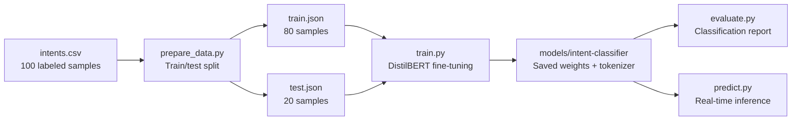

# Intent Classification Fine-Tuning

[](https://github.com/christianescamilla15-cell/fine-tuning-demo/actions/workflows/ci.yml)


Fine-tune **DistilBERT** (multilingual) for Spanish customer intent classification using HuggingFace Transformers. Classifies customer messages into 5 intents: **sales**, **support**, **billing**, **escalation**, and **general**.

## Training Pipeline



## Quick Start

### Install Dependencies

```bash
pip install -r requirements.txt
```

### Prepare Data

```bash
python -m src.prepare_data
```

### Train Model

```bash
python -m src.train
```

Training runs for 1 epoch by default (demo mode, ~2 min on CPU). Edit `src/train.py` to increase epochs for better accuracy.

### Evaluate

```bash
python -m src.evaluate
```

Outputs accuracy, precision, recall, and F1-score per intent.

### Predict

```bash
python -m src.predict
```

Example output:
```
quiero comprar algo
  -> sales (92.3%)

mi pedido no llego
  -> support (87.1%)

necesito mi factura
  -> billing (94.5%)
```

## Project Structure

```
fine-tuning-demo/
├── data/
│   └── intents.csv           # 100 labeled Spanish customer messages
├── src/
│   ├── prepare_data.py       # Dataset splitting (stratified 80/20)
│   ├── train.py              # DistilBERT fine-tuning with HuggingFace Trainer
│   ├── evaluate.py           # Metrics: accuracy, precision, recall, F1
│   └── predict.py            # Inference with confidence scores
├── tests/
│   ├── test_data.py          # Data pipeline tests
│   ├── test_model.py         # Model component tests
│   └── test_predict.py       # Inference pipeline tests
├── models/                   # Saved model weights (gitignored)
├── notebooks/
│   └── training_analysis.md  # Training configuration and results
├── requirements.txt
├── Dockerfile
└── .github/workflows/ci.yml
```

## Model Details

| | |
|---|---|
| **Base model** | `distilbert-base-multilingual-cased` |
| **Task** | Sequence classification (5 classes) |
| **Language** | Spanish |
| **Framework** | HuggingFace Transformers + PyTorch |
| **Training data** | 100 labeled customer messages |
| **Evaluation** | Stratified 80/20 split |

## Docker

```bash
docker build -t intent-classifier .
docker run intent-classifier
```

## Tests

```bash
pytest tests/ -v
```

## Tech Stack

- **PyTorch** — Deep learning framework
- **HuggingFace Transformers** — Pre-trained model and Trainer API
- **scikit-learn** — Data splitting and evaluation metrics
- **DistilBERT** — Efficient multilingual transformer

## Author

**Christian Hernandez** — AI & Automation Specialist
